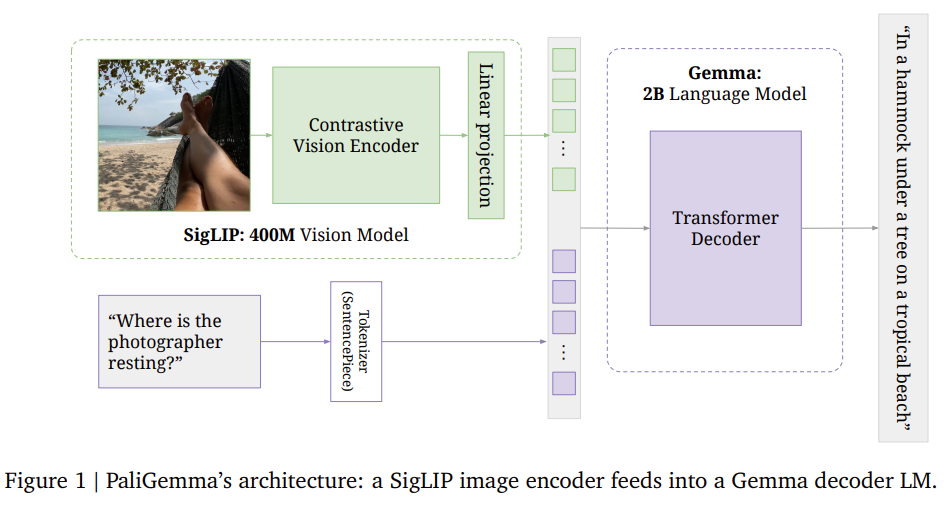
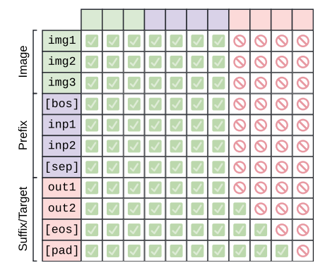

# PaliGemma: Multimodal Language Model from Scratch

This repository contains an toy implementation of the PaliGemma model, a Multimodal (Vision) Language Model built from scratch using only Python and PyTorch.

## Overview

PaliGemma is a transformer-based model that combines vision and language processing capabilities. It's designed to handle both image and text inputs, making it suitable for a variety of multimodal tasks.

## Key Features

- Vision Transformer (ViT) for image processing
- Multimodal interaction between vision and language
- Transformer-based architecture for contextualized embeddings
- KV-Caching for efficient token-by-token generation
- Rotary Position Embedding (RoPE) for improved positional encoding
- Contrastive learning for aligning vision and language modalities

## Model Architecture

The PaliGemma model consists of several key components:

1. **Vision Transformer**: Processes input images and converts them into embeddings.
2. **Language Model**: Based on the Gemma architecture, processes text and image embeddings.
3. **Multimodal Projector**: Aligns vision and language features.

## Understanding PaliGemma's Unique Aspects

### Token Generation Process

1. Input token embeddings are fed to the transformer.
2. The transformer outputs contextualized embeddings.
3. Embeddings are projected into logits.
4. Logits are converted to probability scores using softmax.
5. The next token is selected (e.g., using greedy strategy or top-p sampling).

### Masking and Attention

PaliGemma uses a unique masking strategy that differs from many other language models:

- **Image Tokens**: Fully attend to each other and the entire prefix.
- **Prefix Tokens**: Have bidirectional attention within the prefix and to image tokens.
- **Generated Tokens (Suffix/Target)**: 
  - Attend to all image tokens and prefix tokens.
  - Have causal attention to previously generated tokens.
  - Cannot attend to future tokens or padding.

This approach allows for full context utilization in the prompt while maintaining causality in generation.

### KV-Caching: A Deep Dive

KV-Caching is a crucial optimization technique used in PaliGemma for efficient inference. Let's break it down using an example:

Suppose we want to generate the phrase "I love football":

1. **Without KV-Caching:**
   - Input "I" → Output embedding for "I"
   - Input "I love" → Output embeddings for "I" and "love"
   - Input "I love football" → Output embeddings for "I", "love", and "football"

   This process recalculates the entire self-attention matrix each time, which is computationally expensive.

2. **With KV-Caching:**
   - Input "I":
     - Calculate and cache Key (K) and Value (V) for "I"
     - Output embedding for "I"
   - Input "love":
     - Use cached K and V for "I"
     - Calculate new K and V for "love" and cache them
     - Compute self-attention using K and V for both "I" and "love"
     - Output embedding for "love"
   - Input "football":
     - Use cached K and V for "I" and "love"
     - Calculate new K and V for "football" and cache them
     - Compute self-attention using K and V for "I", "love", and "football"
     - Output embedding for "football"

Benefits of KV-Caching:
- Reduces redundant calculations
- Significantly speeds up inference for long sequences
- Allows for efficient token-by-token generation

By caching the Key and Value states, we only need to compute the Query (Q) for the new token at each step, drastically reducing the computational load.

## Acknowledgements

1. [Coding a Multimodal (Vision) Language Model from scratch in PyTorch with full explanation](https://www.youtube.com/watch?v=vAmKB7iPkWw&t=1s)

